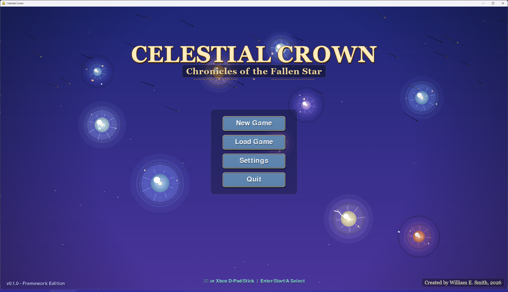

# Celestial Crown

Celestial Crown is a Python tactical RPG prototype inspired by Ogre Battle, currently focused on a real-time strategic map that hands off into sprite-based engagement combat.

> I built this project with agentic AI workflows to grow my practical skill in using AI to architect, implement, and iterate on game systems.



## Current Project State

The project is actively in gameplay iteration mode.

- Main launch path is development-focused: the game starts directly in strategic battle and primes an immediate enemy clash.
- Strategic map supports camera pan, edge scrolling, wheel zoom, objective control, squad orders, and pressure/income simulation.
- Opposing squads entering collision radius now push into a dedicated engagement state.
- Engagements now show animated combat playback with sprites, HP bars, per-action hit/miss/damage, and winner/loss reporting.
- Menu input behavior distinguishes mouse hover visuals from keyboard/controller focus visuals.

## Gameplay Flow

1. Start in strategic battle (dev default).
2. Squads move/capture sites on the world map.
3. When opposing squads collide, game pushes a tactical engagement scene.
4. Engagement resolves and returns to strategic state with losses applied.
5. Mission completion transitions back to town/campaign progression.

## Controls

### Strategic Battle

- Mouse wheel: zoom in/out
- Move mouse to screen edges: scroll map
- TAB: cycle selected allied squad
- 1-6: order selected squad to site index
- R: recall selected squad
- SPACE: pause/resume simulation
- ESC: withdraw to town

### Engagement Scene

- Enter or Space: speed up playback
- Enter or Space after result: return to strategy
- ESC: return immediately

### Menus

- Keyboard/controller navigation uses focused selection highlight
- Mouse uses hover highlight

## Getting Started

### Requirements

- Python 3.11-3.13 recommended
- pygame-ce runtime (installed via requirements)

### Install

```bash
pip install -r requirements.txt
```

### Run

```bash
python main.py
```

### Tests

```bash
pip install -r requirements-dev.txt
python -m pytest -q
```

## Development Notes

- Entry point is [main.py](main.py).
- Current startup in [main.py](main.py) intentionally bypasses main menu for faster battle iteration.
- Strategic state is implemented in [src/states/battle.py](src/states/battle.py).
- Engagement playback state is implemented in [src/states/engagement.py](src/states/engagement.py).
- Strategic mission rules and collision radius live in [src/strategy/models.py](src/strategy/models.py).

If you want to boot into the main menu instead, change startup state creation in [main.py](main.py) to use MainMenuState.

## Repository Layout

```text
CelestialCrown/
├── main.py
├── src/
│   ├── core/        # Engine loop, state management, campaign/services
│   ├── states/      # Main menu, town, strategic battle, engagement playback
│   ├── strategy/    # Strategic mission models, map rendering, sprite registry
│   ├── battle/      # Core combat math and turn-order helpers
│   ├── entities/    # Units, classes, stats, progression
│   ├── ui/          # Buttons, menus, HUD components
│   ├── effects/     # Animated background/effect helpers
│   ├── input/       # Input mapper and high-level actions
│   ├── map/
│   ├── story/
│   └── town/
├── data/            # Scenarios and campaign data
├── assets/          # Audio/sprites/art
└── tests/           # Unit and integration tests
```

## Documentation

- [Design Philosophy](DesignPhilosophy.md)
- [Architecture](Architecture.md)
- [UI/UX Philosophy](UIUXPhilosophy.md)
- [Roadmap](RoadMap.md)
- [Development Guide](docs/DEVELOPMENT.md)

## License

See [LICENSE](LICENSE).
